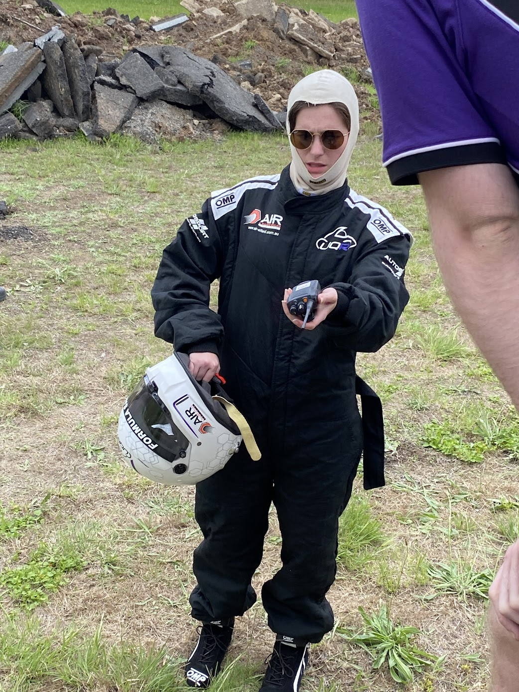

# About Me

Greetings! I'm Cristina, currently pursuing dual degrees in Electrical Engineering and Commerce majoring in Finance. As a student, I delve into the intricacies of both disciplines, aiming to bridge the gap between technology and business.

Join me as I navigate the complexities of dual degrees, exploring the dynamic intersections of engineering, finance, and beyond!

---

### Electrical Enthusiast
In the field of Electrical Engineering, my primary focus lies in understanding and optimizing the electricity grid. From studying power systems to analyzing grid stability, I'm deeply interested in the technical challenges and innovations shaping our energy infrastructure.

### UQ Racing Aficionado
Beyond academics, I actively participate in [UQ Racing](uqracing.com), a platform where I apply engineering principles to the real world of Formula Student! Collaborating with a diverse team, I contribute to designing and building racecars, gaining invaluable hands-on experience in project management and engineering innovation. I'm also a driver for the team - though it's much less glamorous than what Drive to Survive might make it seem!

